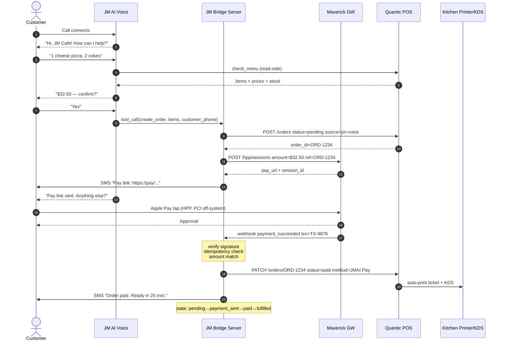
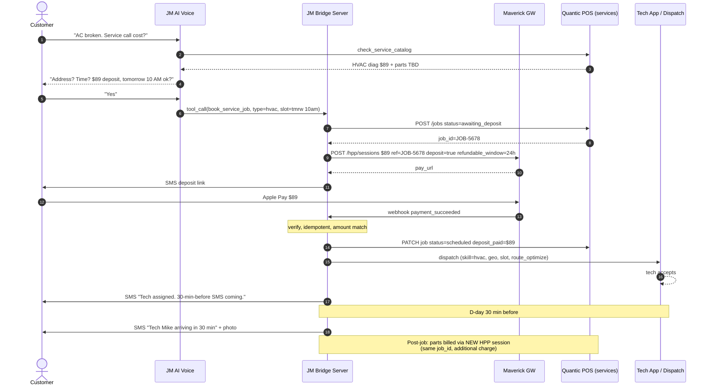
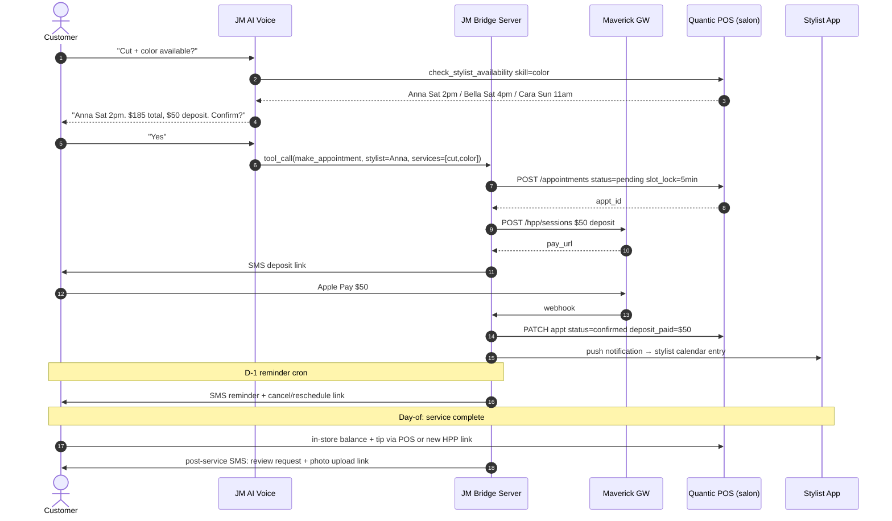
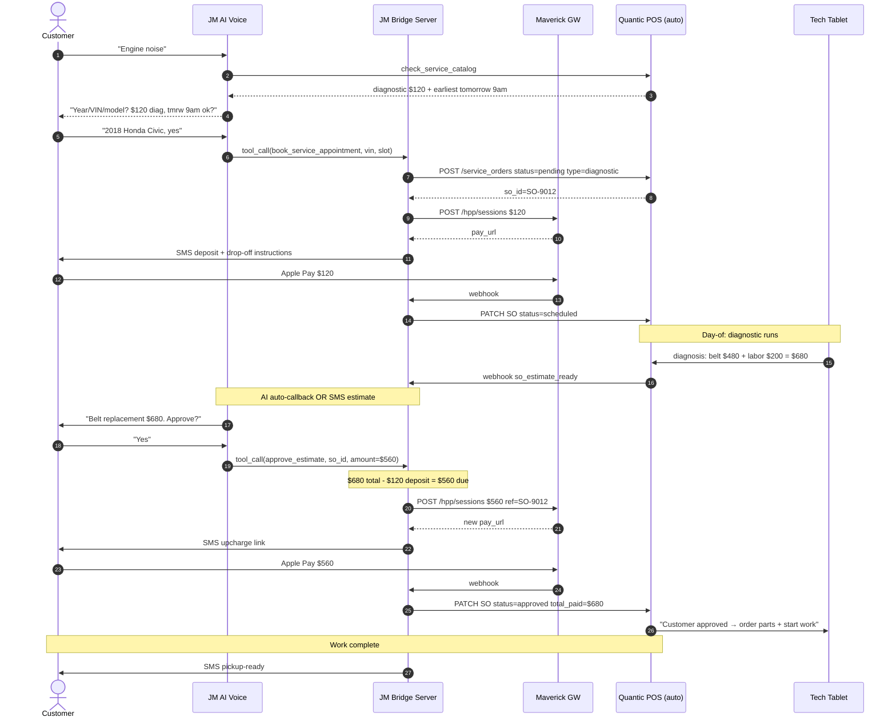

# End-to-End Transaction Sequences — JM Voice AI Platform

> **Date**: 2026-04-28
> **Status**: architecture spec, pre-implementation
> **Scope**: Voice intent capture → Bridge Server → Maverick payment GW → Quantic POS
> **Verticals covered**: restaurant, home services, beauty salon, auto repair
> **Companion docs**: `docs/competitive-analysis.md`, `docs/retrospectives/phase-2a.md`

---

## 1. The architectural shift in one paragraph

Phase 2-A shipped voice → reservation INSERT in our own DB. The new architecture
elevates the system from "AI receptionist" to **vertical-agnostic transaction OS**.

Three structural shifts:

1. **Business model**: subscription → subscription + POS revenue share + payment
   processing margin (3-stack revenue). ARPU goes from ~$200/mo to $2,000+/mo
   per location once payment volume routes through us.
2. **Moat**: feature race → stack lock-in. POS as our brand means losing AI doesn't
   lose the merchant. Maple cannot match this — they sit on top of someone else's POS.
3. **Vertical**: restaurant-only → 4 verticals on the same skeleton. Maple has
   zero presence in home services, beauty, auto. Our agency dashboard already
   supports the multi-vertical model.

---

## 2. Three layers, clean responsibilities

```
┌─────────────────────────────────────────────────────────────────────────┐
│  Layer A — JM AI Voice (Retell + Gemini)                                │
│  • Conversation, language, intent capture                               │
│  • Function Calling tools yield structured intents                      │
│  • Output: tool_call(name, args) e.g. create_order, book_service_job   │
└─────────────────────────────────────────────────────────────────────────┘
                              │ structured intent
                              ▼
┌─────────────────────────────────────────────────────────────────────────┐
│  Layer B — JM Bridge Server  ★ THIS IS THE NEW CORE                    │
│  • Pending object creation in POS / system of record                    │
│  • Maverick HPP session creation                                        │
│  • SMS dispatch with one-time pay URL                                   │
│  • Webhook receipt + signature verification + idempotency               │
│  • State machine: pending → payment_sent → paid → fulfilled             │
│  • Audit trail row per state transition                                 │
│  • Reconciliation cron for stuck pendings                               │
└─────────────────────────────────────────────────────────────────────────┘
                  │ POS REST                  │ payment REST
                  ▼                           ▼
┌──────────────────────────────┐    ┌──────────────────────────────┐
│  Layer C — Quantic POS       │    │  Layer C — Maverick Gateway  │
│  (or vertical SoR)           │    │  (PCI scope here, NOT in B)  │
│  • Order/job/appointment     │    │  • Hosted payment page       │
│  • Kitchen / dispatch /      │    │  • Apple Pay / Google Pay    │
│    stylist / mechanic        │    │  • Card on file              │
│  • Settlement, reporting     │    │  • Webhook on settlement     │
└──────────────────────────────┘    └──────────────────────────────┘
```

**Key invariants**:
- Layer B never sees a card number (all PCI-scope work is in Maverick HPP).
- Layer C never speaks to the customer (all customer comms via Layer B → Twilio).
- Layer A produces structured output only; never writes to POS or moves money directly.

---

## 3. Bridge Server — the five non-negotiable safety properties

The Bridge Server is the company's vault. Five properties are protocol-level
requirements, not feature requests:

### 3.1 Idempotency at every step
Every external call must be safe to retry. Same Maverick `transaction_id`
arriving twice = one POS write, not two. Same `tool_call_id` from Gemini being
re-emitted on Retell barge-in = one pending order, not two. Idempotency keys
live in the database with a 24h expiry, indexed for sub-millisecond lookup.

### 3.2 Webhook signature verification
Every Maverick webhook is verified using the merchant secret + HMAC scheme
specified by Maverick's docs. Unsigned or signature-mismatch webhooks return
401 and are NOT acted on. Without this, an attacker can POST `payment_succeeded`
to our endpoint and trigger a free POS write.

### 3.3 State machine
Each transaction object has an explicit state in `{pending, payment_sent,
paid, fulfilled, canceled, failed, refunded}`. Transitions are server-enforced,
one-way (except refund), and logged. No code path bypasses the state machine.

### 3.4 Audit trail
Every state transition writes a row to `bridge_events` with: txn_id, from_state,
to_state, source (voice|webhook|cron|admin), actor, payload_hash, ts.
Compliance, dispute resolution, and debugging all read from this single source.

### 3.5 Reconciliation cron
Background job that runs every 5 minutes:
- pending older than 30 min → cancel + apologize SMS
- payment_sent older than 60 min without webhook → query Maverick for status,
  resync state
- paid older than 30 min without POS write success → retry POS write or alert
  human operator

Without this, transient failures (network blip, Maverick hiccup, POS downtime)
silently corrupt state.

---

## 4. The common skeleton — every vertical, every transaction

All four verticals share this exact 11-step skeleton. Vertical differences live
only in (a) POS endpoint names, (b) deposit-vs-fullpay rules, (c) dispatch target.

```
Step  | Actor                | Action
------|----------------------|---------------------------------------------------
  1   | Customer             | Initiates call
  2   | AI Voice             | Greeting + intent discovery
  3   | AI Voice → Gemini    | check_* tool: catalog/menu/availability
  4   | AI Voice             | Confirms total + verbal summary
  5   | Customer             | "Yes" (user_explicit_confirmation = true)
  6   | AI Voice → Bridge    | tool_call(create_*) with structured args
  7   | Bridge → POS         | POST /<object>  status=pending or awaiting_deposit
  8   | Bridge → Maverick    | POST /hpp/sessions  amount, ref=POS_id
  9   | Bridge → Twilio      | SMS pay URL to customer phone
 10   | Customer             | Apple/Google/card on Maverick HPP (PCI off-system)
 11   | Maverick → Bridge    | webhook payment_succeeded
        Bridge: verify sig + idempotency + amount match
        Bridge → POS: PATCH status=paid (write-back triggers fulfillment)
        Bridge → Customer: confirmation SMS
```

The four verticals diverge only at:
- step 7 (object type)
- step 8 (deposit-only vs full pay)
- step 11 fulfillment target (kitchen vs dispatch vs calendar)

---

## 5. Vertical-specific sequences

### 5.1 Restaurant — order → pay → kitchen



**Restaurant invariants**:
- Pre-pay only (no deposit-vs-balance split)
- 24h-old pending orders auto-canceled (kitchen capacity protection)
- Modifier prices computed server-side from POS catalog, never from voice transcript

### 5.2 Home services — quote → deposit → tech dispatch



**Home services invariants**:
- Deposit refundable until 24h before slot
- Tech assignment = skill + geo + slot 3-tuple match
- Post-job add-ons create new HPP sessions linked to same job_id
- 30-min-before SMS scheduled via cron at booking time

### 5.3 Beauty salon — appointment → deposit → stylist calendar



**Beauty invariants**:
- Pending appointments lock the slot for 5 minutes (prevents race) — auto-release if unpaid
- Deposit forfeited on no-show, applied to balance on attendance
- Stylist self-service block-out via mobile UI
- Tip distribution rules in POS (server splits tips per house policy)

### 5.4 Auto repair — diagnostic → deposit → tech → estimate → upcharge



**Auto repair invariants**:
- Two-stage payment (diagnostic deposit + post-estimate upcharge) on same SO
- Multiple HPP sessions per service order, each with different amount + reason
- AI auto-callback after diagnosis = manager time saved (this is the unique unlock)
- VIN-driven catalog lookup = parts/time auto-validated against vehicle model

---

## 6. Cross-vertical comparison

| Aspect              | Restaurant       | Home Services        | Beauty             | Auto Repair        |
|---------------------|------------------|----------------------|--------------------|--------------------|
| AI tool name        | `create_order`   | `book_service_job`   | `make_appointment` | `book_service_appointment` |
| POS object          | order            | job                  | appointment        | service_order      |
| Pre-payment         | full pre-pay     | deposit ($)          | deposit ($)        | diagnostic deposit |
| Multi-stage pay?    | no (typically)   | yes (parts add-on)   | yes (balance+tip)  | yes (estimate up)  |
| Dispatch target     | kitchen KDS      | tech (skill+geo+slot)| stylist calendar   | mechanic (skill+slot) |
| D-1 reminder?       | no (pickup)      | 30-min-before        | 24h reminder       | drop-off SMS       |
| No-show / cancel    | n/a (paid)       | 24h refund / forfeit | 24h refund / forfeit | reschedule       |
| AI auto-callback?   | none             | post-job changes     | none               | **mandatory**      |
| Slot lock?          | no               | implicit (deposit)   | 5-min explicit     | no                 |
| Common skeleton hit | yes              | yes                  | yes                | yes                |

The skeleton is identical. Only adapter parameters change.

---

## 7. Database schema sketch (Bridge Server)

```sql
-- One row per high-level transaction (order/job/appt/SO)
CREATE TABLE bridge_transactions (
    id              uuid primary key default gen_random_uuid(),
    store_id        uuid not null references stores(id),
    vertical        text not null check (vertical in ('restaurant','home_services','beauty','auto_repair')),
    pos_object_type text not null,      -- 'order' | 'job' | 'appointment' | 'service_order'
    pos_object_id   text not null,      -- foreign id from Quantic
    customer_phone  text not null,      -- E.164
    customer_name   text,
    state           text not null default 'pending'
                    check (state in ('pending','payment_sent','paid','fulfilled','canceled','failed','refunded')),
    total_cents     bigint not null,
    paid_cents      bigint not null default 0,
    call_log_id     text references call_logs(call_id),
    created_at      timestamptz not null default now(),
    updated_at      timestamptz not null default now()
);

-- Maverick HPP sessions — one transaction can have many (deposit, balance, upcharge)
CREATE TABLE bridge_payments (
    id                  uuid primary key default gen_random_uuid(),
    transaction_id      uuid not null references bridge_transactions(id) on delete cascade,
    maverick_session_id text unique,
    maverick_txn_id     text unique,           -- set on webhook arrival
    amount_cents        bigint not null,
    purpose             text not null,         -- 'deposit'|'balance'|'estimate'|'addon'|'tip'
    state               text not null default 'pending',
    pay_url             text,
    sent_to_phone       text,
    sent_at             timestamptz,
    succeeded_at        timestamptz,
    failed_at           timestamptz,
    failure_reason      text,
    idempotency_key     text unique not null,
    created_at          timestamptz not null default now()
);

-- Append-only audit log
CREATE TABLE bridge_events (
    id              bigserial primary key,
    transaction_id  uuid references bridge_transactions(id),
    payment_id      uuid references bridge_payments(id),
    event_type      text not null,            -- 'state_transition'|'webhook_received'|'sms_sent'|'pos_write'|'reconcile'
    from_state      text,
    to_state        text,
    source          text not null,            -- 'voice'|'webhook'|'cron'|'admin'
    actor           text,
    payload_hash    text,
    payload_json    jsonb,
    created_at      timestamptz not null default now()
);

CREATE INDEX ON bridge_transactions (store_id, state, created_at desc);
CREATE INDEX ON bridge_payments (transaction_id, state);
CREATE INDEX ON bridge_events (transaction_id, created_at desc);
```

---

## 8. Implementation phases

| Phase  | Scope                                                      | Days  |
|-------:|------------------------------------------------------------|------:|
| 2-B.0  | Bridge Server skeleton (state machine, schema, audit)      | 1     |
| 2-B.1  | Maverick adapter (HPP create + webhook verify) — TDD       | 2     |
| 2-B.2  | Quantic adapter (read-side: catalog/menu/availability)     | 1     |
| 2-B.3  | Quantic adapter (write-side: pending + paid)               | 1     |
| 2-B.4  | Restaurant `create_order` end-to-end — first vertical live | 2     |
| 2-B.5  | Reconciliation cron + alerts                               | 0.5   |
| 2-C    | Home services `book_service_job`                           | 2     |
| 2-D    | Beauty `make_appointment` (refactor existing)              | 1     |
| 2-E    | Auto repair `book_service_appointment` + estimate flow     | 2     |
| 3      | AI auto-callback (estimate ready → outbound voice)         | 2     |
| 4      | Phase 3 CRM + caller recognition                           | 1.5   |

≈ 16 Claude-pair-days for full 4-vertical end-to-end.

---

## 9. Decisions still open (need founder input)

1. **Quantic API access**: white-label gives us native injection, but exact endpoint
   list, auth scheme, and rate limits need to come from Quantic's tech team.
2. **Maverick webhook signature scheme**: needs official spec from Maverick (HMAC SHA-256?
   Per-merchant secret? Replay window?). Cannot finish 2-B.1 without this.
3. **Idempotency key strategy**: client-generated UUID vs server-derived hash of
   `(store_id, customer_phone, intent_args)`. Recommendation: client UUID with
   server-side hash as fallback.
4. **Refund flow**: which states allow refund, who triggers (AI vs manager UI).
5. **Multi-tenancy isolation**: per-store secrets vs per-platform secret.
   Recommendation: per-store, vault-backed.

---

## 10. The strategic compounding effect

Once the skeleton ships once (restaurant), every additional vertical is a thin
adapter — days, not months. By Q4:

- 4 verticals × N stores per vertical = total addressable lock-in
- Payment volume × take rate = recurring revenue independent of subscription
- POS as our brand = merchant cannot leave without losing their POS

This is the same trajectory Toast took (POS → capital → marketing → payroll).
The difference: we start with AI voice as the wedge, which means we acquire
merchants at a tenth of Toast's CAC.

The bet: Maple optimizes a single feature for restaurants. We build the OS for SMB.
